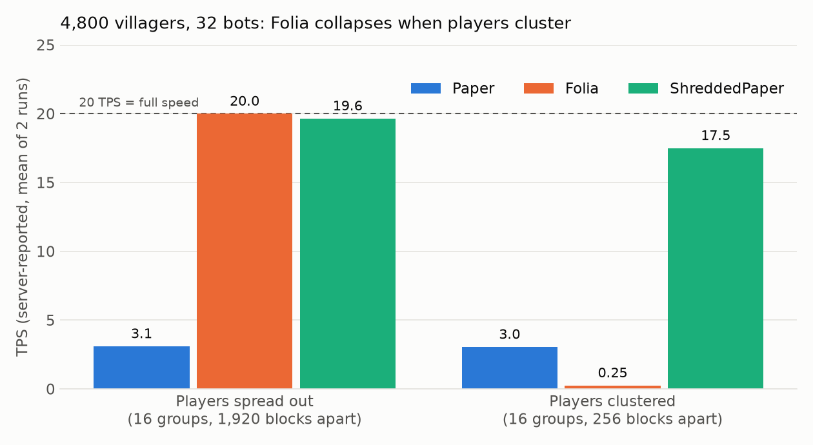
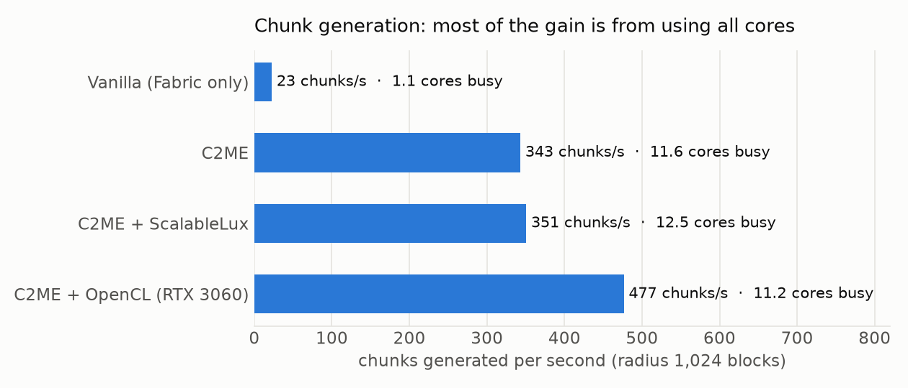
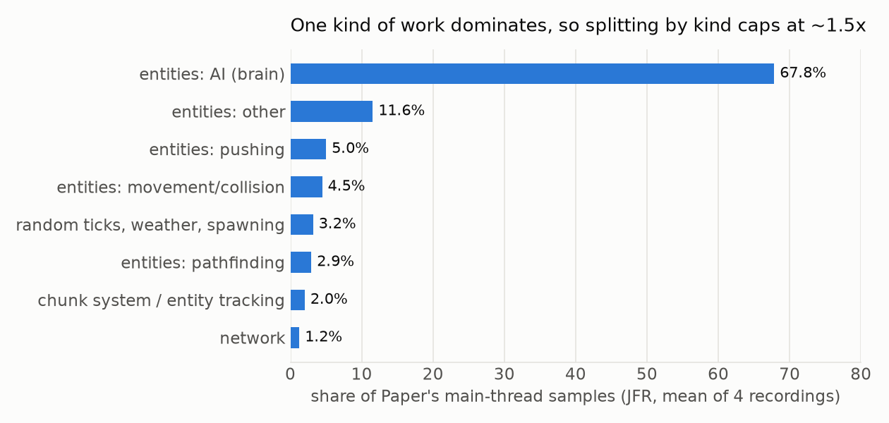

# How many cores can a Minecraft server use?

English | [日本語](README.ja.md)

Measurements on one desktop PC with Minecraft Java Edition 26.1.2:

1. How much faster chunk generation gets with all CPU cores, and with the GPU
2. Whether mob work (pushing, pathfinding) is worth moving to the GPU
3. Paper vs Folia vs ShreddedPaper under the same bot swarm, with players spread out and clustered
4. The most you could gain by giving each *kind* of server work its own core

Every number below comes from the raw data in `results/`, via `summarize.py` → [`results/SUMMARY.md`](results/SUMMARY.md). The charts come from `charts.py`.

## Key findings

- **Vanilla chunk generation uses about 1 core.** It makes 22.8 chunks/s. C2ME spreads the work over about 11.6 cores and makes 343 chunks/s (15.1x). The C2ME OpenCL add-on on an RTX 3060 raises this to 477 chunks/s (20.9x). Terrain from the GPU path matches vanilla closely. It differs slightly more than two vanilla runs differ from each other, mostly near the surface.
- **The GPU does not help mobs at normal counts.** Pushing beats one CPU core at a few thousand mobs, and beats all cores at around 16,000. fp32 is unsafe. For a horde chasing one player, a shared flow field on one CPU core takes 0.16 ms. Per-mob A* takes 18.5 ms for 1,000 mobs. The GPU flow field is slower than the CPU one.
- **Folia only helps when players are far apart.** With default settings, players within 1,536 blocks share one region; at 1,920 blocks they are split. With players spread out, Folia and ShreddedPaper both hold 20 TPS at 4,800 villagers, while Paper drops to about 3-4. With players clustered 256 blocks apart, Folia runs everything in one region at **0.24-0.26 TPS, slower than Paper**. ShreddedPaper keeps **17.3-17.7 TPS**.
- **Splitting by kind of work caps at about 1.5x.** Villager brain logic takes 66-70% of Paper's main thread. A tick cannot get shorter than its largest kind of work, which makes about 1.5x the upper bound. Splitting only "mobs" from "everything else" gives about 1.1x. The work has to be split by place or by entity.

## Setup

| | |
|---|---|
| CPU | Intel Core i5-14600KF (14 cores, 20 threads) |
| RAM | 32 GB |
| GPU | NVIDIA GeForce RTX 3060 12 GB (OpenCL 3.0 / CUDA) |
| OS | Windows 11 |
| Java | Eclipse Temurin 25.0.4.1 |
| Servers | Fabric 0.19.5 + fabric-api 0.155.3 / Paper 26.1.2 build 74 / Folia 26.1.2 build 8 / ShreddedPaper 26.1.2 build 18 |
| Mods | C2ME 0.4.0-alpha.0.62, C2ME OpenCL Acceleration Module (same version), ScalableLux 0.3.0-alpha.0.2, Chunky 1.5.3, spark 1.10.187 |
| Bots | mineflayer 4.39.0 (offline mode, `127.0.0.1` only) |
| Seed | 20260927 |

## 1. Chunk generation

Chunky pre-generated a square of radius 1,024 blocks (16,641 chunks). The four configurations ran interleaved, three times each.

| config | chunks/s per run | vs vanilla |
|---|---|---|
| Vanilla (Fabric only) | 23.4 / 23.2 / 21.8 | 1.0x |
| C2ME | 355.4 / 331.4 (first run 136.4, outlier) | 15.1x |
| C2ME + ScalableLux | 362.9 / 338.9 (first run 188.4, outlier) | 15.4x |
| C2ME + OpenCL (GPU) | 483.1 / 457.6 / 489.8 | 20.9x |

The two outlier runs started right after vanilla's 6-7 minute shutdown save. CPU cores busy (radius 512): vanilla 1.13 and 1.14, C2ME 11.58, C2ME + OpenCL 11.10 and 11.32, out of 20 logical.

### Is the terrain the same?

`compare_worlds.py` compared the central 625 chunks (61,440,000 blocks) block by block. Vanilla itself does not give identical worlds from the same seed ([MC-55596](https://mojira.dev/MC-55596)), so the baseline is vanilla vs vanilla.

| pair | any block differs | terrain shape differs (ground/fluid/air) | shape, y 56..79 |
|---|---|---|---|
| vanilla vs vanilla (baseline) | 0.293% | 0.0076% | 0.011% |
| vanilla vs C2ME | 0.399% | 0.0116% | 0.044% |
| vanilla vs C2ME + OpenCL | 0.448% | 0.0146% | 0.071% |
| C2ME + OpenCL vs C2ME + OpenCL | 0.396% | 0.0108% | 0.026% |

Most block-type differences are decorations placed after terrain: leaves, leaf litter, ores and stone blobs. Terrain shape differs in about 1 block in 7,000 for the GPU path, more than the vanilla baseline and mostly near the surface. That fits C2ME-ocl's own note that biome borders can rarely shift by one or two blocks. Each pair was compared once.

## 2. Mob work on the GPU

CPU (numba) and GPU (a hand-written CUDA kernel via CuPy) run the same spatial-grid algorithm.

**Pushing** (`mobs/push_bench.py`) uses vanilla's `Entity.push` formula. Pushing only adds to velocities, so the result does not depend on the order entities are processed in. GPU times include host↔device transfers.

| scenario | mobs | CPU 1 core | CPU all cores | GPU fp64 |
|---|---|---|---|---|
| 4×4 pen | 1,600 | 4.2 ms | 0.742 ms | 6.51 ms |
| dense crowd | 16,000 | 5.3 ms | 1.92 ms | 1.77 ms |
| dense crowd | 256,000 | 144 ms | 44.4 ms | 20.4 ms |

The GPU has a fixed cost of about 0.7 ms per call. With fp32, the maximum relative error reached 0.11-0.12 in dense crowds of 64k-256k mobs and 0.23 with 256k spread-out mobs, because "within 0.6 blocks" checks flip. With fp64 the error is around 1e-16.

**Pathfinding** (`mobs/path_bench.py`): 128×128 map, 25% walls, all mobs chasing one player.

| mobs | A* per mob, 1 core | A* per mob, all cores | flow field, 1 core | flow field, GPU |
|---|---|---|---|---|
| 10 | 0.153 ms | 0.194 ms | 0.161 ms | 2 ms |
| 1,000 | 18.5 ms | 8.7 ms | 0.161 ms | 2 ms |
| 10,000 | 188 ms | 76.9 ms | 0.161 ms | 2 ms |

The win comes from the algorithm (one shared field instead of one search per mob), not from the GPU. It only applies when mobs share a target. Every method's path lengths matched a BFS reference for every mob.

## 3. Paper vs Folia vs ShreddedPaper

Test conditions:
- 16 groups of 2 bots each (32 bots). Each group's leader bot spawned villagers with `/summon`. Difficulty was peaceful.
- Folia `threaded-regions.threads` and ShreddedPaper `thread-count` were both set to 12.
- TPS is what each server reports: the median region for Folia, the 1-minute average for the others.
- Cores = the server process's CPU time divided by wall time.

**Folia region merging.** With default settings (grid-exponent 4, view-distance 6), players within 1,536 blocks were put in one region, and players 1,920 blocks or more apart were split ([`results/folia_region_merge.txt`](results/folia_region_merge.txt)).

**Players spread out** (1,920 blocks apart):

| villagers | Paper | Folia | ShreddedPaper |
|---|---|---|---|
| 1,600 | TPS 12.2 / 12.9, 1.3 cores | TPS 20.0 / 20.0, 4.2 cores | TPS 20.0 / 20.0, 3.6-3.8 cores |
| 4,800 | TPS 4.1 / 3.9, 1.3 cores | TPS 20.0 / 20.0, 8.0-8.3 cores | TPS 20.0 / 20.0, 7.0-7.5 cores |
| 9,600 | TPS 2.1 / 2.0, 1.3 cores | TPS 11.7 / 13.8, 13.3-14.5 cores | TPS 11.7 / 12.0, 9.3 cores |

**Spread out vs clustered** (4,800 villagers):

| server | 1,920 blocks apart | 256 blocks apart |
|---|---|---|
| Paper | TPS 2.90 / 3.30, 1.4 cores | TPS 2.50 / 3.60, 1.3 cores |
| Folia | TPS 20.00 / 20.00, 8.7-9.4 cores, 16 regions | **TPS 0.24 / 0.26, 1.2 cores, 1 region** |
| ShreddedPaper | TPS 19.30 / 20.00, 7.7-8.6 cores | **TPS 17.30 / 17.70, 5.3 cores** |

## 4. Splitting work by kind

JFR sampled Paper's `Server thread` for 120 s, four times with 4,800 villagers. `analyze_jfr.py` put each sample into a category by the method it was inside.

| work | share |
|---|---|
| entities: brain (AI) | 65.9-69.6% |
| entities: other | 10.8-12.6% |
| entities: pushing | 4.7-5.5% |
| entities: movement/collision | 4.3-4.7% |
| entities: pathfinding | 1.7-4.1% |
| random ticks, weather, spawning | 2.6-3.4% |
| chunk system / entity tracking | 1.8-2.2% |
| scheduled block/fluid ticks (redstone etc.) | 0.2-0.6% |

If each kind ran on its own core, a tick could not get shorter than its largest kind. The upper bound is therefore **1.44-1.52x** (Amdahl). Splitting only mobs from everything else gives about 1.1x.

## Limitations

- One PC, two or three runs per condition. The bots ran on the same PC as the server and used 0.3-0.6 cores.
- The load is villager-heavy. Villagers without beds or workstations keep searching for points of interest (POI). This is close to a worst case and inflates the brain's share. Servers built around trading halls or redstone would show a different breakdown.
- One world, generated with C2ME + OpenCL, was shared by all servers. The Paper-based servers migrated its folder layout at startup.
- Canvas (a Folia fork) was not tested: its official download page could not be fetched automatically.
- The mob GPU experiments re-implement the formulas outside the server. They do not include the cost of wiring a GPU into the Java server.

## Invalid runs kept on purpose

| file | what went wrong |
|---|---|
| `results/invalid_chunkgen_run1_overlapping_save.jsonl` | The next config started before vanilla finished saving, so the runs overlapped. Discarded and re-run. |
| `results/servers_run1.jsonl` | **Folia rows are invalid.** Folia has no `/function` command (Unknown command), so the datapack spawned no villagers. The Paper and ShreddedPaper rows are valid. |
| `results/servers_trials.jsonl` | Trial runs before the setup was fixed. Groups were close enough that Folia used one region. |

## Reproduce

Server jars, the JDK, mods and worlds are not included. Get each from its official source.

1. Unpack Temurin JDK 25 into `jdk/`.
2. Put each server at `servers/<name>/server.jar`.
   - Fabric configs: `vanilla`, `c2me`, `c2me-lux`, `c2me-ocl`
   - Paper-based: `paper`, `folia`, `shredded`
3. Put mods in each server's `mods/` and Chunky in `plugins/`.
4. Set these in `server.properties`: `level-seed=20260927`, `online-mode=false`, `server-ip=127.0.0.1`, `pause-when-empty-seconds=0`.
5. Accept the Minecraft EULA in `eula.txt` if you agree to it.
6. Run `cd bots && npm install`.

| task | command |
|---|---|
| chunk generation speed | `./run_all.sh` |
| worlds for the terrain comparison | `./run_parity.sh` |
| terrain comparison | `python compare_worlds.py worlds/A worlds/B --radius-chunks 12 [--terrain]` |
| shared world | `python bench.py c2me-ocl 3050 --save-world-as shared_r3050`, then copy `datapack/bench` into `worlds/shared_r3050/datapacks/` |
| server comparison | `./run_servers.sh`, `./run_folia_fix.sh`, `./run_kinds.sh` |
| mobs | `python mobs/push_bench.py`, `python mobs/path_bench.py` (needs a CUDA GPU and CuPy) |
| tables / charts | `python summarize.py > results/SUMMARY.md`, `python charts.py` |

**Cite as:** Tsuruta (2026). *How many cores can a Minecraft server use?* Zenodo. https://doi.org/10.5281/zenodo.23008263

Minecraft is a trademark of Mojang Studios. This project is not affiliated with Mojang or Microsoft. Code is MIT licensed.
